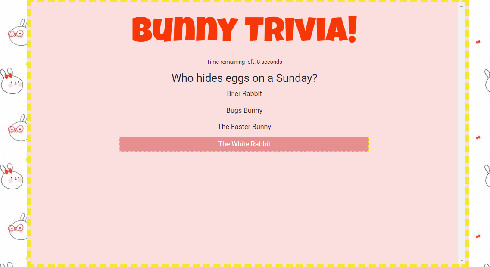
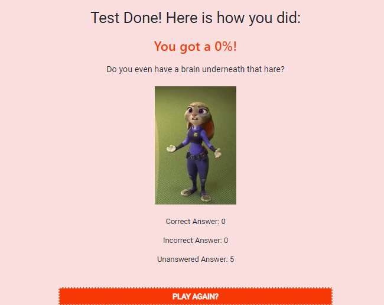

# Trivia Game

This [website](https://ddiongzon001.github.io/TriviaGame/) is a responsive, quick, and fun timed quiz game about cartoon rabbits.

The user is prompted to start the 5 question quiz and has 10 seconds to answer the question correctly.



After clicking on one of the four choices, it informs the user whether or not they got their answer correct or incorrect. If the user does not click on an answer, it is marked as unanswered.


At the end of the game, it reveals the user's score as well as an overall summary of their performance. If the user wants to, they can replay the game.



## Technologies used and why
* HTML - main language to build the portfolio page
* CCS - main language to design and format the page
* [Bootstrap](https://getbootstrap.com/) - open-source library to make the website resposive & add buttons
* [Font Awesome](https://fontawesome.com/?from=io) - open-source library of free to use icons & graphics to add better styling

## Snippets of Code

All the questions, which are stored in an array, were made into an object with multiple properties:
* Actual question
* Four choices stored in an array
* Correct answer
* Image for the result page
```javascript
var test = [{
        question: "Who hides eggs on a Sunday?",
        choices: ["Br'er Rabbit", "Bugs Bunny", "The Easter Bunny", "The White Rabbit"],
        answer: "The Easter Bunny",
        image: "../TriviaGame/assets/images/easter_bunny.jpg"
    },
    {
        question: "He's late for a very important date",
        choices: ["Lola Bunny", "Judy Hopps", "Thumper", "The White Rabbit"],
        answer: "The White Rabbit",
        image: "../TriviaGame/assets/images/white_rabbit.jpg"
    },
```
-----
To test if the user's guess was the correct answer, the website goes through multiple if/else if statements.

The user's choice which is stored in the an answer array, is compared to each choice in each question's object.

If the user's selection matches with the correct choice, it will display the right answer page, otherwise it will display the wrong answer page.

```javascript
if (test[questionCount].answer == test[questionCount].choices[0]) {
    console.log("went through 0");

    $("#answer0").on("click", rightAnswer);
    $("#answer1").on("click", wrongAnswer);
    $("#answer2").on("click", wrongAnswer);
    $("#answer3").on("click", wrongAnswer);


} else if (test[questionCount].answer == test[questionCount].choices[1]){
    console.log("went through 1");

    $("#answer0").on("click", wrongAnswer);
    $("#answer1").on("click", rightAnswer);
    $("#answer2").on("click", wrongAnswer);
    $("#answer3").on("click", wrongAnswer);
```
----
The user only has 10 seconds to answer each question. Everytime a question is displayed, the seconds variable is set to 10 and an interval is set in order to count down the number of seconds remaining.
```javascript
seconds = 10;
timeDisplay.text("Time remaining left: " + seconds + " seconds");
interval = setInterval(countDown, 1000) //remember to change this later!
answerDisplay.text("");
```
MIT © [Dealan](https://ddiongzon001.github.io/)
