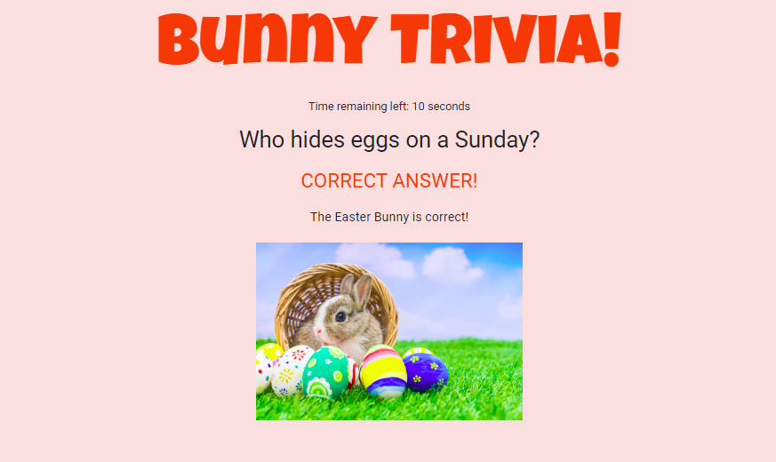

# Trivia Game

This [website](https://ddiongzon001.github.io/TriviaGame/) is a responsive, quick, and fun timed quiz game about cartoon rabbits.

The user is prompted to start the 5 question quiz and has 10 seconds to answer the question correctly.

After clicking on one of the four choices, it informs the user whether or not they got their answer correct or incorrect. If the user does not click on an answer, it is marked as unanswered.

At the end of the game, it reveals the user's score as well as an overall summary of their performance.

## Technologies used and why
* HTML - main language to build the portfolio page
* CCS - main language to design and format the page
* [Bootstrap](https://getbootstrap.com/) - open-source library to make the website resposive & add buttons
* [Start Bootstrap](https://startbootstrap.com/) - open-source library with templates & snippets to further increase the styling
* [Font Awesome](https://fontawesome.com/?from=io) - open-source library of free to use icons & graphics to add better styling

## Credits
* [About Me Page Reference](https://startbootstrap.com/themes/freelancer/) - Took the header and the avatar and updated to my preferences
* [Portfolio Page Reference](https://startbootstrap.com/snippets/half-slider/) - Took the whole snippet (scrolling header and navbar) and updated to my preferences
* [Contact Page Reference](https://startbootstrap.com/snippets/full-image-background/) - Took the whole snippet and updated to my preferences

MIT © [Dealan]()
